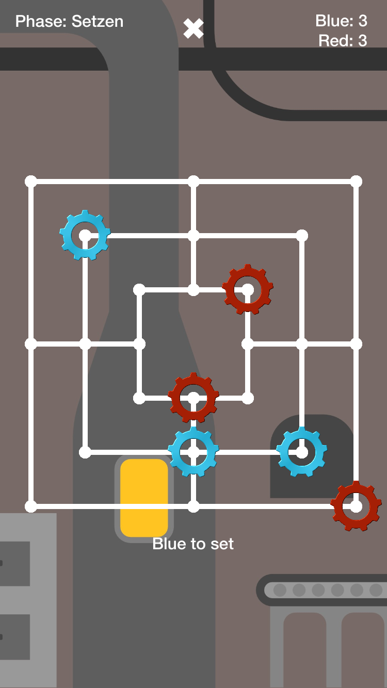

# Muehle

The game Muehle was developed in context of [IT-Talents Code Competition 10/2017](https://it-talents.de/foerderung/code-competition/code-competition-10-2017).

## Installation
It was developed using the latest beta of Xcode (Version 9.1 beta, 9B46), so I recommend using the same version to run the app.

If there are any problems with the installation, please contact me!

## Game Modes & AI Implementation

### Player vs Player
This is mode can be played with two players on one device.

### Player vs AI - Easy
The AI sets tiles at random coordinates, moves tiles randomly and removes at random coordinates.

### Player vs AI - Medium
The AI uses a MiniMax algorithm with Alpha-Beta-Prunning to calculate the best turn in depth of 2 and rates the game / turn with the `HeuristicTest` heuristic.

### Player vs AI - Hard
The AI uses a MiniMax algorithm with Alpha-Beta-Prunning to calculate the best turn in depth of 2 and rates the game / turn with a `HeuristicStrong` heuristic.

### AIMiniMax Implementation

The AI uses a MiniMax alogrithm with Alpha-Beta-Prunning to determine the best possible move. It uses the game to calculate the best move / value for the AI. 
Theretoo it uses Heuristics to adjust values to find the best move for the difficulty of the AI.
Unfortunately I can only use a depth of 2, because otherwise calculation of a move would  take too long, which is very sad, because the implemented solution would have the ability of calculating better moves. 
If I had more time left, I would have optimized this calculation, which would allow deeper-depth-calculations and better results.

## Themes & Shop

Every theme that you can buy has its own expressionistic background music, which were created by [@GammaDigamma](https://soundcloud.com/gammadigamma).
UI Components like the board and labels automatically adapt the background style of the theme and change their colors.
Themes can be bought in the Shop in the menu.

At the moment there are two themes:

#### Normal Theme (Default)

* _Coins:_ _Is bought by default_
* _Player A:_ Blue Stone
* _Player B:_ Red Stone

#### Wood Theme

* _Coins:_ 100
* _Player A:_ Blue Stone
* _Player B:_ Red Stone

#### Space Theme

* _Coins_: 100
* _Player A_: Blue Rocket
* _Player B_: Red Rocket

#### Industry Theme
* _Coins_: 100
* _Player A_: Blue Gear
* _Player B_: Red Gear

#### Snowy Theme
* _Coins_: 100
* _Player A_: Blue Sledge
* _Player B_: Red Sledge

## Architecture

This game follows the MVC-Design-Pattern (Model, View, Controller).

### Model

#### Game `(Game.swift)`
The Game model contains all the logic to model a Nine Men Morris game.
It coordinates Player and AI moves and transfers them via `GameDelegate` protocol.

### View
The UI sits in `Main.storyboard` and `GameScene.sks`.
The App uses Apple's SpriteKit technology.
The Board is being rendered in a `SKTileMapNode` with images.

### Controller
The controller gets game events via the `GameDelegate` protocol and displays them in the view.
Theretoo it registers touches to set and remove tiles and turns in `Game.swift`.
Furthermore it updates the prompt and status labels.

## Known bugs:

Sometimes the prompt label does not update correct.

